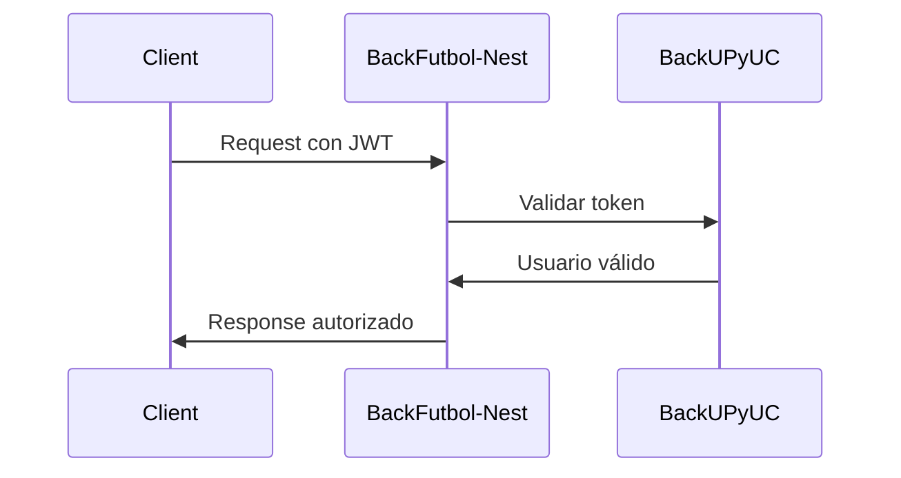
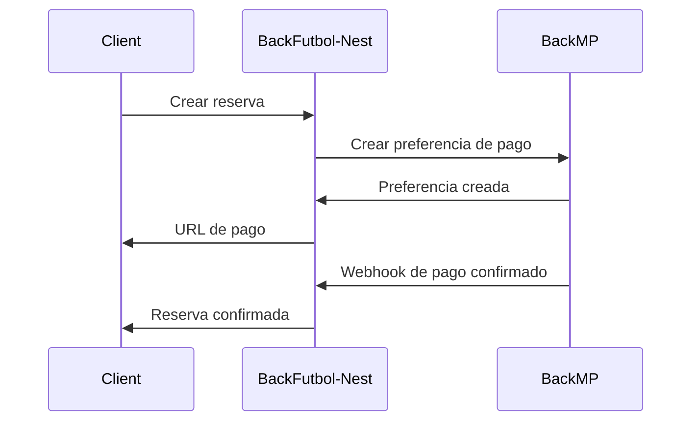

# 🔧 Mejoras Implementadas en BackFutbol-Nest

## 📋 Resumen de Cambios

Este documento detalla todas las mejoras implementadas para convertir BackFutbol-Nest en un microservicio limpio, desacoplado y preparado para producción.

## 🎯 Objetivos Cumplidos

### ✅ Arquitectura de Microservicios

- **Eliminación de responsabilidades cruzadas**: Removido manejo de usuarios y autenticación local
- **Integración con microservicios externos**: Comunicación con BackUPyUC y BackMP
- **Desacoplamiento**: Cada servicio tiene responsabilidades claras y definidas

### ✅ Preparación para Producción

- **Health checks**: Endpoints de monitoreo completos
- **Docker optimizado**: Multi-stage build con health checks
- **Configuración AWS**: CloudFormation template y scripts de despliegue
- **Variables de entorno**: Configuración segura y flexible

### ✅ Validaciones y Seguridad

- **Guards externos**: Validación de tokens JWT de BackUPyUC
- **Roles y permisos**: Sistema de autorización robusto
- **Manejo de errores**: Filtros y interceptores mejorados

## 🏗️ Cambios Arquitectónicos

### 1. Eliminación de Módulos Locales

**Antes:**

```typescript
// Módulos locales que manejaban usuarios
UsersModule;
AuthModule;
```

**Después:**

```typescript
// Integración con microservicios externos
IntegrationModule;
ExternalAuthService;
PaymentIntegrationService;
```

### 2. Nuevos Servicios de Integración

#### ExternalAuthService

```typescript
// Valida tokens JWT de BackUPyUC
async validateToken(token: string): Promise<ExternalUser>
async getUserInfo(userId: number, token: string): Promise<ExternalUser>
hasRole(user: ExternalUser, requiredRole: string): boolean
isUserActive(user: ExternalUser): boolean
```

#### PaymentIntegrationService

```typescript
// Integra con BackMP para pagos
async createPaymentPreference(...): Promise<PaymentPreference>
async getPaymentStatus(paymentId: string): Promise<PaymentStatus>
async validatePaymentForBooking(...): Promise<boolean>
```

### 3. Nuevos Guards Externos

#### ExternalJwtAuthGuard

- Valida tokens JWT de BackUPyUC
- No maneja autenticación local
- Fallback a validación local si es necesario

#### ExternalRolesGuard

- Verifica roles de usuarios externos
- Compatible con sistema de roles de BackUPyUC
- Logging de intentos de acceso no autorizados

## 🏥 Sistema de Health Checks

### Endpoints Implementados

```typescript
GET / api / v1 / health; // Health check básico
GET / api / v1 / health / ready; // Readiness probe
GET / api / v1 / health / live; // Liveness probe
```

### Verificaciones Incluidas

1. **Base de datos**

   - Conexión activa
   - Tiempo de respuesta
   - Migraciones aplicadas (readiness)

2. **Servicios externos**

   - BackUPyUC disponible
   - BackMP disponible
   - Tiempo de respuesta

3. **Aplicación**
   - Uptime
   - Versión
   - Entorno

### Respuesta de Health Check

```json
{
  "status": "ok",
  "timestamp": "2024-01-15T10:30:00.000Z",
  "uptime": 3600000,
  "version": "1.0.0",
  "environment": "production",
  "checks": {
    "database": {
      "status": "ok",
      "responseTime": 5
    },
    "externalServices": {
      "backUPyUC": {
        "status": "ok",
        "responseTime": 50
      },
      "backMP": {
        "status": "ok",
        "responseTime": 30
      }
    }
  }
}
```

## 🐳 Optimizaciones Docker

### Dockerfile Mejorado

```dockerfile
# Multi-stage build
FROM node:18-alpine AS base
RUN apk add --no-cache dumb-init curl

# Etapas separadas para desarrollo y producción
FROM base AS development
FROM base AS build
FROM base AS production

# Health check integrado
HEALTHCHECK --interval=30s --timeout=10s --start-period=5s --retries=3 \
  CMD curl -f http://localhost:3000/api/v1/health || exit 1
```

### Docker Compose Actualizado

```yaml
services:
  backend:
    healthcheck:
      test: ['CMD', 'curl', '-f', 'http://localhost:3000/api/v1/health']
      timeout: 10s
      retries: 5
      interval: 30s
      start_period: 40s
    environment:
      BACK_UPYUC_URL: http://localhost:3001
      BACK_MP_URL: http://localhost:3002
```

## ☁️ Configuración AWS

### CloudFormation Template

- **ECS Cluster** con Fargate
- **Application Load Balancer**
- **Target Groups** con health checks
- **Security Groups** configurados
- **IAM Roles** con permisos mínimos
- **CloudWatch Logs**

### Script de Despliegue

```bash
./scripts/deploy-aws.sh production
```

**Características:**

- Verificación de prerrequisitos
- Construcción y push de imagen Docker
- Despliegue automático con CloudFormation
- Verificación post-despliegue

## 🔐 Seguridad Mejorada

### Variables de Entorno

```env
# Configuración segura
NODE_ENV=production
JWT_SECRET=your-secure-secret
BACK_UPYUC_URL=https://backupyuc.example.com
BACK_MP_URL=https://backmp.example.com

# Configuración de base de datos
DB_HOST=your-rds-endpoint
DB_PASSWORD=your-secure-password
```

### Validación de Tokens

```typescript
// Validación con fallback
try {
  // Intentar validar con BackUPyUC
  const user = await this.validateWithBackUPyUC(token);
} catch (error) {
  // Fallback a validación local
  const user = await this.validateLocally(token);
}
```

## 📊 Monitoreo y Logging

### Interceptores Mejorados

```typescript
// LoggingInterceptor
- Log de requests entrantes
- Log de responses salientes
- Tiempo de respuesta
- Información de usuario (si está autenticado)

// HttpExceptionFilter
- Manejo centralizado de errores
- Logging estructurado
- Respuestas estandarizadas
```

### Métricas Disponibles

- Tiempo de respuesta por endpoint
- Estado de servicios externos
- Uso de recursos
- Errores y excepciones

## 🔄 Flujo de Integración

### Autenticación



### Pagos



## 🧪 Testing

### Tests Unitarios

```bash
npm run test
```

### Tests E2E

```bash
npm run test:e2e
```

### Health Check Tests

```bash
# Verificar health check
curl http://localhost:3000/api/v1/health

# Verificar readiness
curl http://localhost:3000/api/v1/health/ready

# Verificar liveness
curl http://localhost:3000/api/v1/health/live
```

## 🚀 Próximos Pasos

### Para BackUPyUC

1. **Endpoint de validación de tokens**

   ```
   GET /api/v1/auth/validate
   Authorization: Bearer <token>
   ```

2. **Endpoint de información de usuario**

   ```
   GET /api/v1/users/:id
   Authorization: Bearer <token>
   ```

3. **Sistema de roles**
   - PLAYER
   - FIELD_OWNER
   - ADMIN

### Para BackMP

1. **Endpoint de creación de preferencias**

   ```
   POST /api/v1/preferences
   {
     "bookingId": 123,
     "amount": 1000,
     "description": "Reserva cancha",
     "payerEmail": "user@example.com"
   }
   ```

2. **Endpoint de verificación de pagos**

   ```
   GET /api/v1/payments/:id/status
   ```

3. **Webhook para notificaciones**
   ```
   POST /api/v1/webhooks/payment
   ```

## 📈 Métricas de Mejora

### Antes vs Después

| Aspecto           | Antes    | Después      |
| ----------------- | -------- | ------------ |
| Responsabilidades | Cruzadas | Separadas    |
| Autenticación     | Local    | Externa      |
| Health Checks     | Básicos  | Completos    |
| Docker            | Simple   | Optimizado   |
| AWS               | Manual   | Automatizado |
| Seguridad         | Básica   | Robusta      |
| Monitoreo         | Limitado | Completo     |

## 🎉 Beneficios Obtenidos

1. **Escalabilidad**: Servicios independientes y escalables
2. **Mantenibilidad**: Código más limpio y modular
3. **Seguridad**: Validación externa y roles claros
4. **Monitoreo**: Health checks y métricas completas
5. **Despliegue**: Automatizado y reproducible
6. **Resiliencia**: Fallbacks y manejo de errores robusto

---

**✅ BackFutbol-Nest está ahora preparado para producción en AWS con arquitectura de microservicios limpia y desacoplada.**
