# 🔗 Requerimientos para Microservicios Externos

## 📋 Resumen

Este documento especifica los endpoints y funcionalidades que necesitan implementar **BackUPyUC** y **BackMP** para que BackFutbol-Nest funcione correctamente.

## 🔐 BackUPyUC - Microservicio de Usuarios

### Endpoints Requeridos

#### 1. Validación de Token JWT

```
GET /api/v1/auth/validate
Authorization: Bearer <jwt_token>

Response 200:
{
  "user": {
    "id": 123,
    "email": "user@example.com",
    "role": "PLAYER",
    "firstName": "Juan",
    "lastName": "Pérez",
    "isActive": true
  }
}

Response 401:
{
  "message": "Token inválido o expirado",
  "statusCode": 401
}
```

#### 2. Información de Usuario

```
GET /api/v1/users/:id
Authorization: Bearer <jwt_token>

Response 200:
{
  "id": 123,
  "email": "user@example.com",
  "role": "FIELD_OWNER",
  "firstName": "María",
  "lastName": "García",
  "phone": "+5491112345678",
  "isActive": true,
  "profileImage": "https://example.com/avatar.jpg",
  "createdAt": "2024-01-15T10:30:00.000Z",
  "updatedAt": "2024-01-15T10:30:00.000Z"
}
```

#### 3. Sistema de Roles

Los tokens JWT deben incluir el campo `role` con uno de estos valores:

- `PLAYER` - Jugador que puede hacer reservas
- `FIELD_OWNER` - Dueño de cancha que puede crear y gestionar canchas
- `ADMIN` - Administrador con acceso completo

### Estructura del Token JWT

```json
{
  "sub": 123,
  "email": "user@example.com",
  "role": "FIELD_OWNER",
  "iat": 1642234567,
  "exp": 1642320967
}
```

### Configuración de Seguridad

- **JWT Secret**: Clave secreta para firmar tokens
- **JWT Public Key**: Clave pública para validación (opcional)
- **Expiración**: 24 horas por defecto
- **Algoritmo**: HS256 o RS256

## 💳 BackMP - Microservicio de Pagos

### Endpoints Requeridos

#### 1. Crear Preferencia de Pago

```
POST /api/v1/preferences
Content-Type: application/json

Request Body:
{
  "bookingId": 123,
  "amount": 1000,
  "currency": "ARS",
  "description": "Reserva cancha de fútbol - Cancha A",
  "payerEmail": "user@example.com",
  "externalReference": "booking_123",
  "expirationDate": "2024-01-16T10:30:00.000Z"
}

Response 201:
{
  "id": "pref_123456789",
  "initPoint": "https://www.mercadopago.com.ar/checkout/v1/redirect?pref_id=123456789",
  "sandboxInitPoint": "https://sandbox.mercadopago.com.ar/checkout/v1/redirect?pref_id=123456789",
  "externalReference": "booking_123",
  "expirationDate": "2024-01-16T10:30:00.000Z"
}
```

#### 2. Verificar Estado de Pago

```
GET /api/v1/payments/:paymentId/status
Authorization: Bearer <internal_token>

Response 200:
{
  "id": "payment_123456789",
  "status": "approved",
  "externalReference": "booking_123",
  "amount": 1000,
  "currency": "ARS",
  "paymentMethod": "credit_card",
  "installments": 1,
  "transactionAmount": 1000,
  "createdAt": "2024-01-15T10:30:00.000Z",
  "approvedAt": "2024-01-15T10:31:00.000Z"
}
```

#### 3. Webhook para Notificaciones

```
POST /api/v1/webhooks/payment
Content-Type: application/json

Request Body (ejemplo de MercadoPago):
{
  "type": "payment",
  "data": {
    "id": "payment_123456789"
  }
}

Response 200:
{
  "status": "processed",
  "message": "Webhook procesado correctamente"
}
```

### Estados de Pago

- `pending` - Pago pendiente
- `approved` - Pago aprobado
- `rejected` - Pago rechazado
- `cancelled` - Pago cancelado
- `refunded` - Pago reembolsado

### Configuración de MercadoPago

- **Access Token**: Token de acceso a la API de MercadoPago
- **Public Key**: Clave pública para el frontend
- **Webhook URL**: URL para recibir notificaciones
- **Environment**: `sandbox` o `production`

## 🔄 Flujos de Integración

### Flujo de Autenticación

```mermaid
sequenceDiagram
    participant C as Client
    participant BFN as BackFutbol-Nest
    participant BU as BackUPyUC

    C->>BFN: Request con JWT
    BFN->>BU: GET /api/v1/auth/validate
    BU->>BFN: Usuario válido
    BFN->>C: Response autorizado
```



### Flujo de Creación de Reserva con Pago


### Flujo de Validación de Pago


## 🔐 Seguridad

### Autenticación Interna

Para comunicación entre microservicios, implementar:

- **API Keys** para autenticación interna
- **JWT internos** con expiración corta
- **HTTPS** obligatorio en producción
- **Rate limiting** para prevenir abuso

### Headers de Seguridad

```
X-API-Key: internal_api_key_here
X-Service-Name: backfutbol-nest
X-Request-ID: unique_request_id
```

## 📊 Monitoreo

### Health Checks

Cada microservicio debe exponer:

```
GET /health
GET /ready
GET /live
```

### Métricas

- Tiempo de respuesta por endpoint
- Tasa de errores
- Uso de recursos
- Estado de servicios externos

## 🧪 Testing

### Tests de Integración

```bash
# Test de autenticación
curl -H "Authorization: Bearer <token>" \
     http://backupyuc:3001/api/v1/auth/validate

# Test de creación de preferencia
curl -X POST \
     -H "Content-Type: application/json" \
     -H "X-API-Key: <internal_key>" \
     -d '{"bookingId": 123, "amount": 1000}' \
     http://backmp:3002/api/v1/preferences
```

## 🚀 Implementación Sugerida

### BackUPyUC

1. **Framework**: NestJS (recomendado para consistencia)
2. **Base de datos**: PostgreSQL o MySQL
3. **Autenticación**: JWT con refresh tokens
4. **Roles**: Sistema de roles granular
5. **Email**: Servicio de envío de emails

### BackMP

1. **Framework**: NestJS o Express
2. **Base de datos**: PostgreSQL para transacciones
3. **MercadoPago**: SDK oficial
4. **Webhooks**: Endpoint seguro para notificaciones
5. **Logging**: Logs detallados de transacciones

## 📋 Checklist de Implementación

### BackUPyUC

- [ ] Endpoint de validación de tokens
- [ ] Endpoint de información de usuario
- [ ] Sistema de roles (PLAYER, FIELD_OWNER, ADMIN)
- [ ] JWT con estructura requerida
- [ ] Health checks
- [ ] Documentación de API
- [ ] Tests de integración

### BackMP

- [ ] Endpoint de creación de preferencias
- [ ] Endpoint de verificación de pagos
- [ ] Webhook para notificaciones
- [ ] Integración con MercadoPago
- [ ] Manejo de estados de pago
- [ ] Health checks
- [ ] Logs de transacciones
- [ ] Tests de integración

## 🔗 URLs de Desarrollo

### Configuración Local

```env
# BackFutbol-Nest
BACK_UPYUC_URL=http://localhost:3001
BACK_MP_URL=http://localhost:3002

# BackUPyUC
PORT=3001
JWT_SECRET=your_jwt_secret

# BackMP
PORT=3002
MP_ACCESS_TOKEN=your_mercadopago_token
```

### Configuración de Producción

```env
# BackFutbol-Nest
BACK_UPYUC_URL=https://backupyuc.yourdomain.com
BACK_MP_URL=https://backmp.yourdomain.com

# BackUPyUC
JWT_SECRET=your_secure_production_secret
DATABASE_URL=your_production_db_url

# BackMP
MP_ACCESS_TOKEN=your_production_mercadopago_token
WEBHOOK_URL=https://backmp.yourdomain.com/api/v1/webhooks/payment
```

---

**📝 Nota**: Estos requerimientos son mínimos para que BackFutbol-Nest funcione correctamente. Se recomienda implementar funcionalidades adicionales según las necesidades específicas de cada microservicio.
